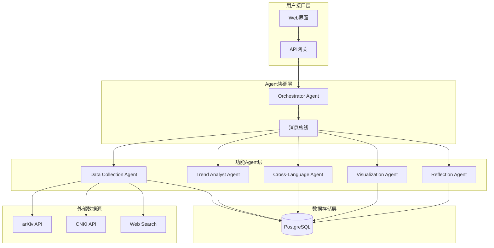

# 学术侦探系统 - 跨语种科研趋势发现系统

[](https://python.org)
[](LICENSE)
[](https://github.com)

## 🎯 项目简介

学术侦探系统是一个基于多Agent协作的智能学术趋势发现平台，通过AI技术帮助研究者：

- 🔍 **智能数据采集**：自动抓取全球最新学术文献
- 📊 **趋势深度分析**：识别研究热点和前沿方向  
- 🌐 **跨语言整合**：打破中英文信息壁垒
- 💎 **蓝海机会发现**：识别低竞争高价值研究方向
- 📈 **智能可视化**：生成交互式知识图谱和研究报告

## ✨ 核心特性

### 🤖 多Agent智能协作
- **Data Collection Agent**：多源学术数据采集
- **Trend Analyst Agent**：研究趋势分析和机会识别  
- **Cross-Language Agent**：中英文概念对齐
- **Visualization Agent**：数据可视化和报告生成
- **Reflection Agent**：系统反思和性能优化
- **Orchestrator Agent**：协调各Agent协作

### 🌍 跨语言学术整合
- 支持中英文文献同时采集和分析
- 智能概念对齐（如：大模型推理 ↔ LLM Reasoning）
- 打破语言信息茧房，促进全球学术交流

### 📊 智能分析能力
- 基于大语言模型的趋势分析
- 机会指数评估算法
- 蓝海研究领域自动识别
- 实时学术热点监测

### 🎨 丰富的可视化
- 交互式知识图谱
- 多维度趋势分析图表
- 自动生成专业研究报告
- 支持多种数据导出格式

## 🚀 快速开始

### 环境要求
- Python 3.8+
- PostgreSQL 12+
- 8GB+ RAM

### 安装步骤

1. **克隆项目**
   ```bash
   git clone <repository-url>
   cd academic-detective
   ```

2. **安装依赖**
   ```bash
   pip install -r requirements.txt
   ```

3. **配置数据库**
   ```bash
   # 初始化数据库
   python scripts/init_database.py
   ```

4. **启动系统**
   ```bash
   # 启动HTTP服务
   bash scripts/http_run.sh -m http -p 5000
   
   # 或直接运行
   python -m src.main
   ```

### 使用示例

```python
from src.agents.agent_simple import process_academic_detective_request

# 分析AI研究趋势
result = process_academic_detective_request("分析当前AI研究领域的趋势，并识别出蓝海研究机会")

# 采集学术数据  
result = process_academic_detective_request("采集机器学习和深度学习相关的最新论文")

# 生成研究报告
result = process_academic_detective_request("生成人工智能领域的研究机会报告")
```

## 📁 项目结构

```
academic-detective/
├── src/                          # 源代码目录
│   ├── agents/                   # Agent实现
│   │   ├── agent.py             # 完整版Agent
│   │   ├── agent_simple.py      # 简化版Agent  
│   │   └── agent_tools.py       # Agent工具函数
│   ├── tools/                    # 工具模块
│   │   ├── data_collection_tool.py
│   │   ├── trend_analysis_tool.py
│   │   ├── cross_language_tool.py
│   │   ├── visualization_tool.py
│   │   ├── reflection_tool.py
│   │   └── web_search_tool.py
│   ├── storage/                  # 数据存储
│   │   ├── database/            # 数据库相关
│   │   └── s3/                  # 对象存储
│   └── utils/                    # 工具函数
│       ├── agent_communication.py # Agent通信机制
│       └── ...
├── config/                       # 配置文件
│   └── academic_detective_config.json
├── docs/                         # 文档
│   ├── ACADEMIC_DETECTIVE_README.md
│   └── architecture.md
├── scripts/                      # 脚本文件
├── tests/                        # 测试文件
└── assets/                       # 资源文件
```

## 🛠️ 技术栈

### 后端技术
- **AI框架**：LangChain + LangGraph
- **大模型**：Doubao-Seed（支持思考和视觉模式）
- **数据库**：PostgreSQL + SQLAlchemy
- **消息队列**：Python Queue-based Agent通信
- **API框架**：FastAPI

### AI能力
- **自然语言处理**：中英文文本分析、主题提取
- **知识图谱**：概念关系挖掘和可视化
- **趋势预测**：基于机器学习的学术趋势分析
- **跨语言对齐**：智能概念映射和翻译

### 数据源
- **arXiv**：最新预印本论文
- **CNKI**：中文学术文献
- **Web Search**：实时学术信息检索
- **RSS订阅**：定期数据更新

## 📊 系统架构图



## 🔧 配置说明

### 系统配置
主要配置文件位于 `config/academic_detective_config.json`：

```json
{
    "config": {
        "model": "doubao-seed-1-6-251015",
        "temperature": 0.7,
        "max_completion_tokens": 10000
    },
    "sp": "你是学术侦探系统的核心AI助手...",
    "tools": [
        "collect_academic_data",
        "analyze_research_trends",
        "identify_blue_ocean_topics"
    ]
}
```

### 环境变量
```bash
export COZE_WORKSPACE_PATH="/workspace/projects"
export COZE_WORKLOAD_IDENTITY_API_KEY="your-api-key"
export COZE_INTEGRATION_MODEL_BASE_URL="your-model-url"
```

## 📈 核心功能展示

### 🎯 学术趋势分析
系统自动分析最新研究论文，识别：
- 📈 热门研究方向
- 🔄 技术演进趋势  
- 💡 突破性研究进展
- 👥 主要研究团队

### 💎 蓝海机会发现
基于多维度评估模型，发现：
- 🔬 低竞争高价值领域
- 🌟 新兴交叉研究方向
- 🎯 技术空白点
- 📊 市场机会分析

### 🌐 跨语言知识整合
智能处理中英文文献：
- 🔗 概念自动对齐
- 📚 双向知识映射
- 🌍 全球学术视野
- 💬 研究信息桥接

### 📊 可视化报告
生成专业分析报告：
- 🕸️ 交互式知识图谱
- 📉 多维度趋势图表
- 📋 自动研究报告
- 📤 多格式导出

## 🧪 测试验证

运行完整测试套件：
```bash
# 系统测试
python test_system.py

# 功能测试
python -m pytest tests/
```

## 📚 API文档

### 核心接口

#### 分析学术趋势
```http
POST /api/analyze
Content-Type: application/json

{
  "request": "分析当前AI研究领域的趋势",
  "options": {
    "topics": ["machine learning", "deep learning"],
    "max_results": 100
  }
}
```

#### 采集学术数据
```http
POST /api/collect
Content-Type: application/json

{
  "queries": ["artificial intelligence", "neural networks"],
  "sources": ["arxiv", "cnki"],
  "max_results": 50
}
```

#### 生成研究报告
```http
POST /api/report
Content-Type: application/json

{
  "topic": "人工智能研究机会",
  "include_visualizations": true,
  "format": "html"
}
```

## 🔍 监控与维护

### 系统监控
- **性能指标**：CPU、内存、网络使用率
- **Agent状态**：各Agent健康状态检查
- **数据质量**：采集数据准确性和完整性
- **用户行为**：API调用统计和用户反馈

### 定期维护
- **数据更新**：每日自动采集最新文献
- **模型优化**：定期更新分析模型
- **系统升级**：安全补丁和功能改进
- **备份恢复**：数据备份和灾难恢复

## 🤝 贡献指南

欢迎参与学术侦探系统开发！

### 开发流程
1. Fork项目仓库
2. 创建功能分支 (`git checkout -b feature/new-feature`)
3. 提交更改 (`git commit -am 'Add new feature'`)
4. 推送分支 (`git push origin feature/new-feature`)
5. 创建Pull Request

### 代码规范
- 遵循PEP 8代码风格
- 添加必要的注释和文档
- 编写单元测试
- 更新相关文档

## 📄 许可证

本项目采用 MIT 许可证 - 查看 [LICENSE](LICENSE) 文件了解详情。

## 🙏 致谢

感谢以下开源项目和服务：
- [LangChain](https://github.com/langchain-ai/langchain) - AI应用开发框架
- [FastAPI](https://github.com/tiangolo/fastapi) - 现代Web框架
- [PostgreSQL](https://www.postgresql.org/) - 强大的关系数据库
- [arXiv](https://arxiv.org/) - 开放学术论文平台

## 📞 联系我们

- 📧 邮箱：academic-detective@example.com
- 🐛 问题反馈：[GitHub Issues](https://github.com/your-repo/issues)
- 💬 讨论交流：[GitHub Discussions](https://github.com/your-repo/discussions)

---

*让AI赋能学术研究，让科研发现更智能* 🚀

---

## 📖 本地运行指南

### 运行完整流程
```bash
bash scripts/local_run.sh -m flow
```

### 运行特定节点
```bash
bash scripts/local_run.sh -m node -n node_name
```

### 启动HTTP服务
```bash
bash scripts/http_run.sh -m http -p 5000
```